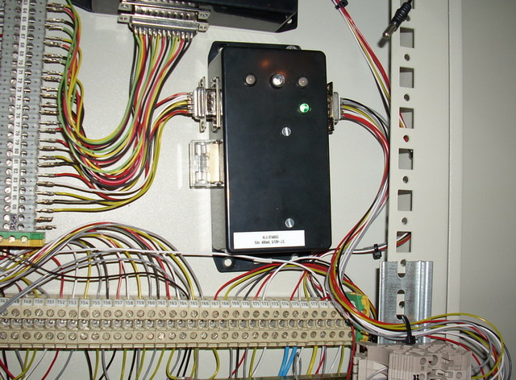

## Source code for project: [Intruder alarm system controller](https://link.stdout.no/S)

A simple intruder alarm controller I build and used in my old apartment. Uses an AVR ATtiny2313 microcontroller.

Written in basic, using [Bascom-AVR](http://www.mcselec.com/).

### Author
[Thomas Jensen](https://thomas.stdout.no)
